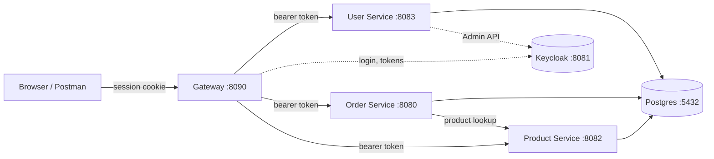

# secure-shop-platform

A small online shop backend, built to explore OAuth2, OpenID Connect and API security hands-on. Four Spring Boot services sit behind one API Gateway, and Keycloak is the only place users log in.

The browser never sees a token. It holds a session cookie, the Gateway keeps the tokens, and each service checks the token it receives on every request.



## Services

| Service | Port | What it owns | Docs |
|---|---|---|---|
| Gateway | 8090 | Login, the user's session and tokens, routing | [gateway.md](docs/services/gateway.md) |
| Product Service | 8082 | Product catalog. Anyone can browse, only admins can change it | [product-service.md](docs/services/product-service.md) |
| Order Service | 8080 | Orders. Each user sees only their own | [order-service.md](docs/services/order-service.md) |
| User Service | 8083 | Registration and user profiles | [user-service.md](docs/services/user-service.md) |
| Keycloak | 8081 | Users, passwords, roles, tokens | [keycloak-setup.md](docs/keycloak-setup.md) |

## Quick start

You need Docker and JDK 21.

```bash
cp docker/.env.example docker/.env        # fill in the three client secrets (any random strings)
docker compose -f docker/docker-compose.yml up -d
set -a; . docker/.env; set +a

cd backend/product-service && ./mvnw spring-boot:run   # one terminal per service
cd backend/order-service   && ./mvnw spring-boot:run
cd backend/user-service    && ./mvnw spring-boot:run
cd backend/gateway         && ./mvnw spring-boot:run -Dspring-boot.run.profiles=dev
```

Then import the Postman collection in [`postman/`](postman/) and run the **Gateway (BFF)** folder. Log in as `testuser` / `test` or `adminuser` / `test`.

Full details, tests and CI: [development.md](docs/development.md).

## Documentation

| Read this | Covers |
|---|---|
| [Architecture](docs/architecture.md) | How the parts fit, the identity model, and step-by-step request flows with sequence diagrams |
| [Gateway](docs/services/gateway.md) | Login, session, token relay, CSRF, logout, dev login |
| [Product Service](docs/services/product-service.md) | Public reads, admin writes |
| [Order Service](docs/services/order-service.md) | Per-user orders, pricing from the catalog |
| [User Service](docs/services/user-service.md) | Registration across Keycloak and Postgres |
| [Keycloak setup](docs/keycloak-setup.md) | Import the realm, or build it by hand click by click |
| [Development](docs/development.md) | Running, testing, Postman, formatting, CI |

## Roadmap

| Phase | Status | Adds |
|---|---|---|
| 0 | Done | Order Service, plain CRUD, no auth |
| 1 | Done | Keycloak, Order Service validates JWTs and scopes |
| 2 | Done | Product Service, public reads, admin writes, order pricing from the catalog |
| 3 | Done | User Service, registration, orders scoped to their owner |
| 4 | Done | Cleaner Keycloak model (realm roles, audience per service, realm as code), API Gateway (BFF) |
| Next | Planned | Next.js frontend, then security hardening and service-to-service auth |

## Stack

Java 21, Spring Boot 3.5, Spring Security, Spring Cloud Gateway (Server Web MVC), PostgreSQL 16 with Flyway, Keycloak 26, Testcontainers, GitHub Actions.
