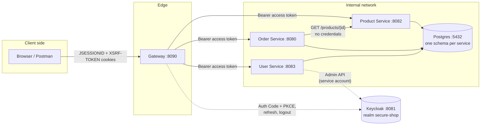
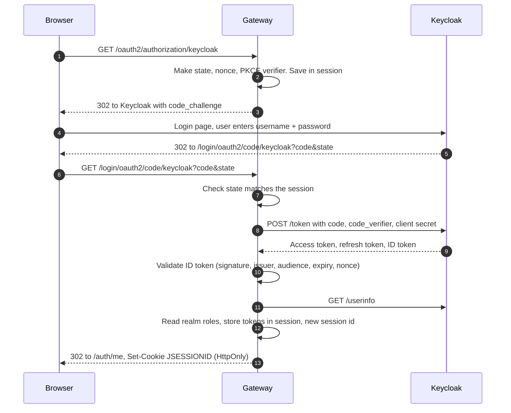
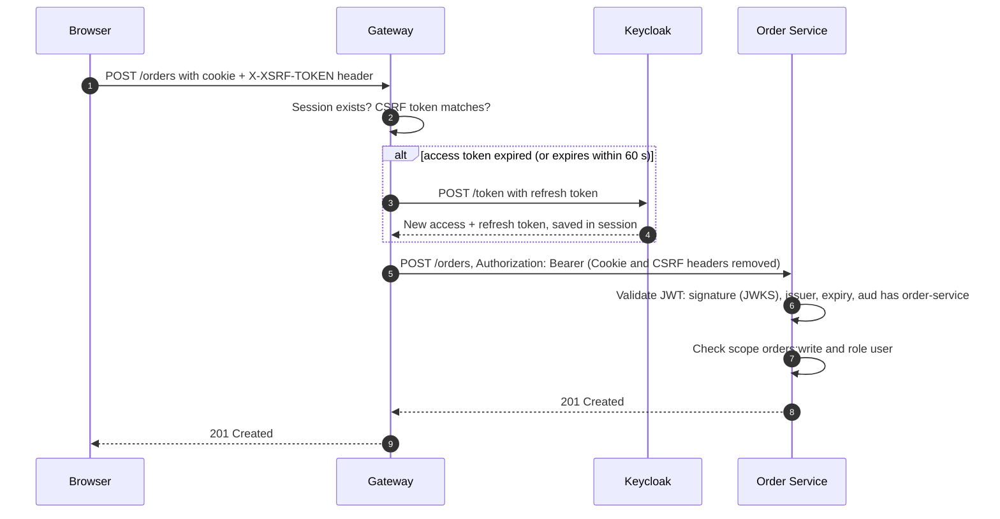
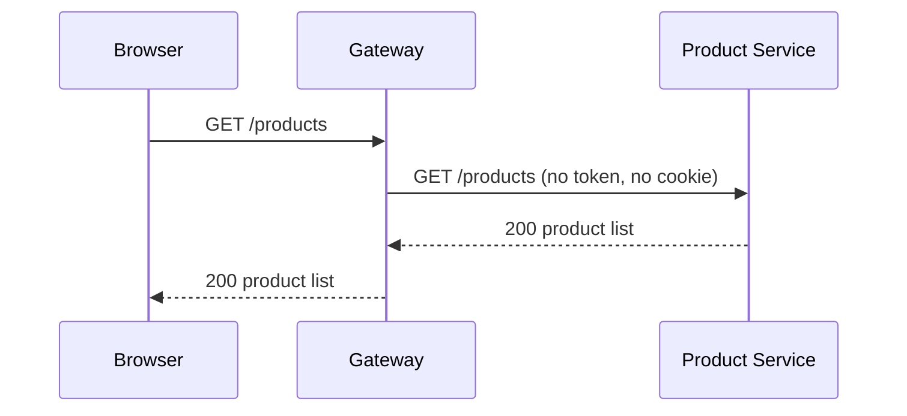
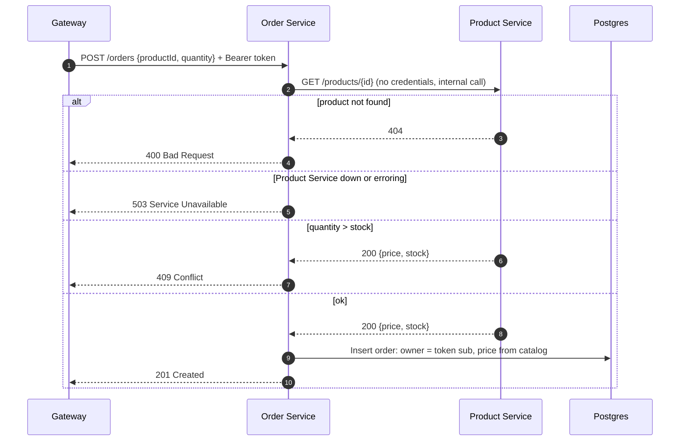
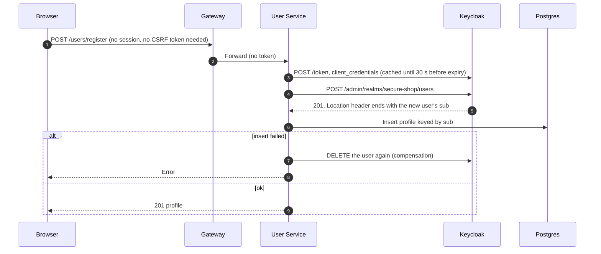
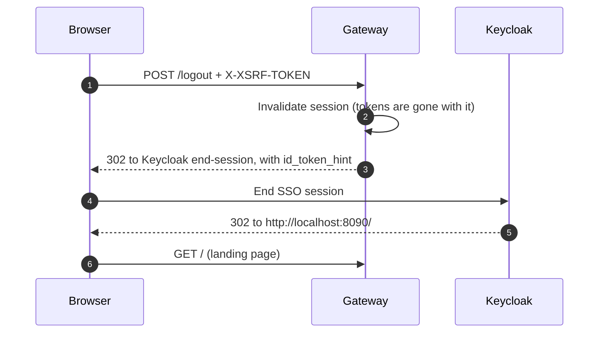

# Architecture

How the parts fit together, who is trusted with what, and what happens on each kind of request.

## The parts

| Part | Holds | Trusts |
|---|---|---|
| Browser | Two cookies: `JSESSIONID` (HttpOnly) and `XSRF-TOKEN`. No tokens | Nothing. Treated as hostile |
| Gateway | The user's session, and inside it the access, refresh and ID tokens | Keycloak's tokens, after checking the ID token |
| Services | Nothing per user between requests (stateless) | Only a token whose signature, issuer, expiry and audience check out |
| Keycloak | Users, passwords, roles, sessions, signing keys | Its own admin config |
| Postgres | `product_schema`, `order_schema`, `user_schema` | Only the services |

Each service owns its schema and its Flyway migrations. No service reads another service's tables.

## Identity model

Three questions, three different answers in the token.

| Question | Answered by | Example | Checked by |
|---|---|---|---|
| What may this app do for the user? | Scope (`scope` claim) | `orders:read`, `orders:write` | Order Service |
| Who is this user? | Realm role (`realm_access.roles`) | `user`, `admin` | Order Service, Product Service |
| Which rows are theirs? | Subject (`sub`) | `7663bcb4-...` | Order Service, User Service |
| Is this token meant for me? | Audience (`aud`) | `order-service` | All three services |

Clients in Keycloak

A client in Keycloak is a caller, not an API. Adding a service adds an audience, never a new login client.

| Client | Used by | Grant | Notes |
|---|---|---|---|
| `secure-shop-gateway` | Gateway, real browser logins | Authorization Code + PKCE `S256` | Confidential (has a secret) |
| `secure-shop-test-client` | Gateway dev login, Postman, curl | Password (direct access grant) | Dev only, never in production |
| `user-service-admin-client` | User Service | Client Credentials | Service account with only `manage-users` and `view-users` |

Why roles are realm roles, not client scopes or client roles

`testuser` and `adminuser` log in through the same client. A scope is granted to the client, so every user of that client would get it, and "admin only" would mean nothing. A role belongs to the user, so it travels with them whichever client they use.

Realm roles rather than client roles because `admin` and `user` mean the same thing to every service. There is one `admin`, not one per service.

Every user gets `user` automatically through `default-roles-secure-shop`, so `/users/register` needs no role logic. Admins hold `admin` as well. An admin is still a user.

Why every token carries an audience

The `secure-shop-audience` client scope adds `order-service`, `product-service` and `user-service` to the `aud` claim of tokens issued to the two user-facing clients. Each service rejects a token that doesn't name it (`401`).

Without it, any valid token from the realm would be accepted everywhere, including tokens minted for some unrelated client. With it, a token is only accepted by the services it was issued for.

What each service checks

| Service | Endpoint | Needs | Fails with |
|---|---|---|---|
| Gateway | `/orders/**`, `/users/**`, writes on `/products/**`, `/auth/me` | A session | `401` |
| Product | `GET /products/**` | Nothing (but a token, if sent, must be valid) | `401` for a bad token |
| Product | `POST`, `PUT`, `DELETE` | Role `admin` | `401` / `403` |
| Order | `GET` | Scope `orders:read` and role `user` | `401` / `403` |
| Order | writes | Scope `orders:write` and role `user` | `401` / `403` |
| Order | `/orders/{id}` | The order's owner is the token's `sub` | `404` |
| User | `POST /users/register` | Nothing | |
| User | `/users/me` | Any valid token. The profile is looked up by `sub` | `401` |
| All three | every authenticated call | `aud` contains the service's own name | `401` |

## Request flows

### Browser login

The Gateway sends the browser to Keycloak, gets a one-time code back, and swaps it for tokens over a direct server-to-server call. The tokens stay in the Gateway.

What each check protects against

| Check | Stops |
|---|---|
| `state` | Login CSRF: an attacker making your browser finish their login |
| PKCE (`code_verifier`) | A stolen authorization code being used by someone else |
| Client secret on the token call | Anyone other than the Gateway swapping the code |
| `nonce` in the ID token | Replaying an old ID token |
| New session id after login | Session fixation |

The token call in step 8 is a direct HTTP call from the Gateway to Keycloak. The browser never sees the response.

### API call through the Gateway

The browser sends its cookie. The Gateway swaps it for the user's access token, refreshing it first if it has expired, and forwards the call.

Failure cases

| What went wrong | Who answers | Status |
|---|---|---|
| No session | Gateway | `401` (never a redirect, so API clients can react) |
| Write without a matching CSRF token | Gateway | `403`, nothing is forwarded |
| Refresh token expired or revoked | Gateway | `401`, log in again |
| Path the Gateway doesn't know | Gateway | `401` without a session, `403` with one (deny by default) |
| Token missing the service's audience | Service | `401` |
| Missing scope or role | Service | `403` |
| Someone else's order | Order Service | `404` |

### Browsing products (public)

`GET /products/**` needs no login. The Gateway forwards it without a token, and Product Service lets it through.

### Placing an order

The client sends only a product id and a quantity. Order Service asks Product Service for the real price and stock before it saves anything.

Why the status codes are chosen this way

| Case | Status | Reason |
|---|---|---|
| Product does not exist | `400` | The bad input is the `productId` in the body. The `/orders` resource is fine, so `404` would mislead |
| Not enough stock | `409` | The request is valid but conflicts with current catalog state |
| Product Service unavailable | `503` | The order isn't wrong, it just can't be priced right now |

Stock is checked, not reserved. Placing an order does not reduce the product's stock.

### Registration

Registration writes to two systems that share no transaction: Keycloak (the account) and Postgres (the profile). If the second write fails, the first is undone.

Details and edge cases

- The new user is not logged in after registering. They log in through the normal flow.
- The password goes straight to Keycloak and is never stored or logged by User Service.
- Username taken in Keycloak: `409`. Keycloak unreachable: `503`.
- If the compensating delete also fails, the user is left in Keycloak without a profile. User Service logs `ORPHANED KEYCLOAK USER ` at ERROR. Nothing retries it. An outbox is the planned fix.
- `register` is not `@Transactional` on purpose. The Keycloak call can't take part in a database transaction, and the annotation would suggest it does.

### Logout

The Gateway ends its own session, then sends the browser to Keycloak so the Keycloak session ends too. Without the second step, the next login would skip the password.

A dev-login session (Postman) has no browser to redirect. There the Gateway calls Keycloak's end-session endpoint itself with the refresh token and answers `204`. See [gateway.md](services/gateway.md).

## Design decisions

BFF: tokens stay in the Gateway, not in the browser

A token in `localStorage` can be read by any script on the page: your code, every npm dependency, third-party widgets. If an XSS bug lets someone steal it, they can use it from their own machine until it expires.

With the BFF pattern the browser holds only an HttpOnly session cookie. XSS can still make requests while the victim's tab is open, but it can't take a token away.

The cost: the Gateway keeps state (sessions), it must handle CSRF because cookies are sent automatically, and it sits in the path of every call.

The Gateway only checks "is there a session"

Scopes, roles, audience and ownership are checked by each service on the token it receives. A service called directly, without the Gateway, applies exactly the same rules. The Gateway is not the security boundary for business rules; it's the boundary for "is this a logged-in browser".

Owner from the token, 404 for someone else's data

There is no `/orders?user=` or `/users/{id}`. The owner always comes from the token's `sub`.

For orders, ownership is part of the database query (`findByIdAndUserSub`). Another user's order looks exactly like an order that doesn't exist, so ids can't be probed. That is why it's `404`, not `403`.

Price comes from the catalog, never from the client

`CreateOrderRequest` has no price field. A client can't order a 99.99 keyboard for 0.01 because there is nowhere to send 0.01.

Realm as code

The realm is a committed file, `docker/keycloak/secure-shop-realm.json`, imported on first start. Client secrets in it are `${...}` placeholders filled from `docker/.env`, so no secret is committed. See [keycloak-setup.md](keycloak-setup.md).

Fail at startup on a missing secret

Spring Boot keeps an unresolved `${KEYCLOAK_..._CLIENT_SECRET}` as literal text instead of failing. The service would start and only break at the first login or registration, with a confusing `401` from Keycloak. The Gateway (`ClientSecretCheck`) and User Service (`KeycloakAdminProperties`) refuse to start instead, and the error names the variable to set.

## Next plans

What isn't built yet, and the plan for it

| Gap | Today | Plan |
|---|---|---|
| Service-to-service auth | Order Service calls Product Service with no credentials | Client Credentials or mTLS (project #03) |
| Back-channel logout | Logging out in Keycloak directly doesn't end the Gateway session | OIDC back-channel logout |
| Stock | Checked when ordering, never reduced | Reservation or decrement |
| Order status | The owner can set any status (`PENDING`, `CONFIRMED`, `CANCELLED`) through `PUT` | Status changes owned by the system, not the client |
| Registration abuse | No rate limit on `POST /users/register` | Rate limit at the Gateway |
| Gateway upstream calls | No timeouts or circuit breaker | Timeouts, `503` mapping |
| Refresh token rotation | Off in Keycloak | Turn on, after handling parallel refreshes |
| TLS | Plain HTTP on localhost | TLS and `Secure` cookies in any shared environment |

