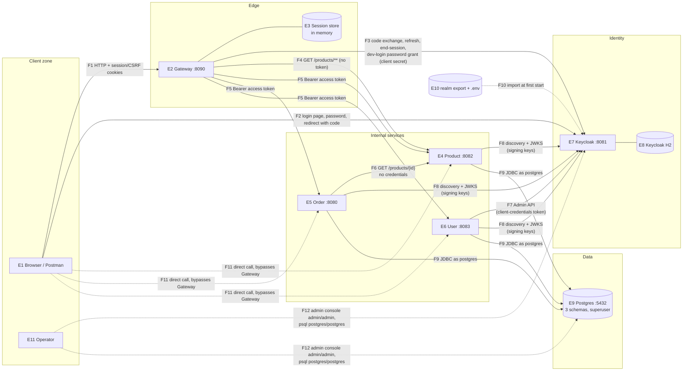

# Threat Model — System

Elements, data flows, trust boundaries and assets. Index and process: [README.md](README.md).

## Elements

| ID | Element | Type | Port | Holds / does |
|---|---|---|---|---|
| E1 | Browser / Postman | External entity | — | `JSESSIONID` (HttpOnly, `SameSite=Lax`) and `XSRF-TOKEN` (readable by JS). Never a token. Types the password into Keycloak's page, not the Gateway |
| E2 | Gateway | Process | 8090 | BFF. Session per user holding access, refresh and ID tokens. Checks only "is there a session". Strips `Cookie` and `X-XSRF-TOKEN` before forwarding; relays the access token on private routes. CSRF on writes. Unmatched paths denied |
| E3 | Gateway session store | Data store (in memory) | — | Security context + `OAuth2AuthorizedClient` (the user's tokens), per `HttpSession` |
| E4 | Product Service | Process | 8082 | Catalog. `GET` public; writes need realm role `admin`. Validates `aud=product-service` |
| E5 | Order Service | Process | 8080 | Orders. Scope `orders:read`/`orders:write` + role `user`. Owner = token `sub`, enforced in the query. Prices from the catalog |
| E6 | User Service | Process | 8083 | Profiles. `POST /users/register` public; `/users/me` any valid token. Holds the `user-service-admin-client` secret |
| E7 | Keycloak | External process | 8081 | Identity provider: users, passwords, roles, sessions, signing keys. Admin console with bootstrap admin `admin`/`admin` |
| E8 | Keycloak store | Data store | — | H2 files in `docker/keycloak-data/` (gitignored). Users, password hashes, client secrets, realm keys |
| E9 | Postgres | Data store | 5432 | `product_schema`, `order_schema`, `user_schema` in one instance. Every service connects as superuser `postgres` |
| E10 | Realm export + `docker/.env` | Data store (files) | — | `secure-shop-realm.json` (committed, secrets as `${...}`), `.env` (gitignored, real client secrets) |
| E11 | Operator | External entity | — | You: starts the stack, uses the Keycloak admin console, Postgres, Postman |

## Data flow diagram

Dashed arrows are flows the design doesn't intend but the current setup allows (`F11`, `F12`) or that happen once (`F10`).

## Data flows

| ID | From → To | Carries | Authenticated by | Crosses |
|---|---|---|---|---|
| F1 | Browser → Gateway | API calls, login start, logout | Session cookie; CSRF header on writes | TB1 |
| F2 | Browser ↔ Keycloak | Login page, username + password, redirect back with `code` + `state` | User's password; PKCE ties the code to the Gateway's session | TB1 |
| F3 | Gateway → Keycloak | `code` + PKCE verifier → tokens; refresh token → new tokens; end-session; dev profile: username + password (password grant) | Gateway client secret (`secure-shop-gateway`, or `secure-shop-test-client` for dev login) | TB5 |
| F4 | Gateway → Product | Public catalog reads | Nothing (public route; `Cookie` stripped) | TB2 |
| F5 | Gateway → Product / Order / User | API calls with the user's access token | Bearer JWT, validated by each service: signature, issuer, expiry, audience | TB2 |
| F6 | Order → Product | `GET /products/{id}` while placing an order | **Nothing** (v1 by design) | TB3 |
| F7 | User → Keycloak | Client-credentials token request; create user (with the new user's password); delete user (compensation and account deletion) | `user-service-admin-client` secret; service account with `manage-users`, `view-users` | TB6 |
| F8 | Product / Order / User → Keycloak | OIDC discovery and JWKS (the public keys every token is checked against) | Nothing (public endpoints); trust rests on reaching the real Keycloak | TB5 |
| F9 | Services → Postgres | All reads and writes; Flyway migrations at startup | Username/password `postgres`/`postgres` from `application.properties` | TB4 |
| F10 | Realm export + `.env` → Keycloak | Clients, roles, scopes, client secrets | File access on the host | TB8 |
| F11 | Anyone on the network → service ports | Any API call, skipping the Gateway | Same token checks as F5 (services don't trust the Gateway) | TB7 |
| F12 | Operator (or anyone on the network) → Keycloak admin console, Postgres | Realm administration; direct SQL | `admin`/`admin`; `postgres`/`postgres` | TB7 |

## Trust boundaries

| ID | Boundary | What crosses it | What is enforced at the line today |
|---|---|---|---|
| TB1 | Client zone ↔ Edge / Identity | F1, F2 | Session cookie + CSRF at the Gateway; password and PKCE at Keycloak. The browser is treated as hostile |
| TB2 | Gateway ↔ services | F4, F5 | Each service validates the token itself; the Gateway is not trusted for business rules |
| TB3 | Service ↔ service | F6 | **Nothing.** Product Service can't tell Order Service from any other caller (fine for a public read; it matters once #03 adds a stock write) |
| TB4 | Services ↔ Postgres | F9 | A password shared by all services, with superuser rights over every schema |
| TB5 | Gateway / services ↔ Keycloak | F3, F8 | Client secret on F3; nothing on F8 beyond reaching the right host. No TLS on either |
| TB6 | User Service ↔ Keycloak Admin API | F7 | Client secret; service-account roles limited to user management |
| TB7 | Network ↔ host ports | F11, F12 | Services: their own token checks. Postgres and Keycloak admin: well-known default passwords. Docker publishes `5432` and `8081` on all interfaces, and Spring Boot binds the services to all interfaces, so the local network can reach them |
| TB8 | Repository / host files ↔ runtime | F10 | `.env` gitignored; the realm export holds `${...}` placeholders only |

## Assets

What an attacker wants, and so what the threats protect.

| Asset | Where | Why it matters |
|---|---|---|
| User sessions | E3, `JSESSIONID` in E1 | A session is a logged-in user, with their tokens behind it |
| Access / refresh tokens | E3 only | Calls to services as the user; refresh extends that beyond the access token's life |
| User passwords | Typed into E7 (F2), sent by E6 (F7 at registration), E8 hashed | Account takeover |
| Client secrets | E10 `.env`, E2/E6 config, E8 | Gateway secret: mint tokens through the Gateway's client. Admin client secret: create and delete any user |
| Realm signing keys | E8, published via F8 | Whoever controls the keys a service trusts can forge any token |
| Keycloak admin access | E7 console | Full control of identity: users, roles, clients, keys |
| Order data | E9 `order_schema` | Per-user purchase history; integrity of prices and quantities |
| Profile data (PII) | E9 `user_schema` | Name, email, address, phone |
| Catalog | E9 `product_schema` | Prices and stock; price integrity is what stops paying 0.01 |
| Availability | E2, E4–E6, E9 | Public endpoints (`GET /products/**`, `POST /users/register`) are open to anyone |

